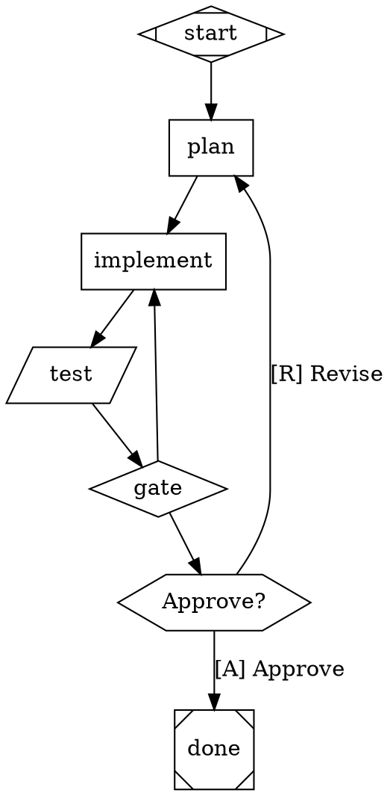

[](https://github.com/TheFellow/fkyeah/actions/workflows/ci.yml)

# F#kYeah

An F# implementation of the [StrongDM Attractor](https://github.com/strongdm/attractor) spec — a DOT-based pipeline runner that orchestrates multi-stage AI workflows using directed graphs.

Write a `.dot` file. Each node is a stage (LLM call, shell command, human gate, conditional branch). Edges define the flow. The engine executes it, calls real LLMs, checkpoints after every stage, and lets you resume if anything fails.

Built from three [NLSpecs](https://github.com/strongdm/attractor#terminology):
- [Attractor Specification](https://github.com/strongdm/attractor/blob/main/attractor-spec.md) — the pipeline engine
- [Coding Agent Loop Specification](https://github.com/strongdm/attractor/blob/main/coding-agent-loop-spec.md) — agentic loop with tool execution
- [Unified LLM Client Specification](https://github.com/strongdm/attractor/blob/main/unified-llm-spec.md) — multi-provider LLM client

**512 tests (384 unit + 128 conformance). Zero warnings. One binary.**

## Quick Start

```bash
# Set at least one API key
export ANTHROPIC_API_KEY=sk-ant-...
export OPENAI_API_KEY=sk-...
export GEMINI_API_KEY=AI...

# Learn the DOT schema
attractor schema

# See a working example
attractor example

# Validate a pipeline
attractor --validate my-pipeline.dot

# Run it
attractor my-pipeline.dot

# Run fully autonomous (no human prompts)
attractor my-pipeline.dot --auto-approve

# Run without API keys (mock LLM responses)
attractor my-pipeline.dot --simulate

# Resume from checkpoint after interruption
attractor my-pipeline.dot --resume attractor-logs/20260217-160000
```

## Write a Pipeline

Pipelines are [Graphviz DOT](https://graphviz.org/doc/info/lang.html) digraphs. Nodes have shapes that determine their behavior:



Run `attractor schema` for the complete attribute reference.

### Node Shapes

| Shape | Type | What it does |
|-------|------|-------------|
| `Mdiamond` | start | Entry point (exactly one required) |
| `Msquare` | exit | Terminal node (exactly one required) |
| `box` | codergen | LLM call — sends `prompt` to the model, writes response to logs |
| `parallelogram` | tool | Runs `tool_command` in a shell, captures stdout/stderr |
| `hexagon` | wait.human | Pauses for human input, shows options from outgoing edge labels |
| `diamond` | conditional | Pass-through — engine evaluates edge conditions to pick next node |
| `component` | parallel | Fan-out — executes all branch targets concurrently |
| `tripleoctagon` | fan_in | Fan-in — consolidates parallel results |
| `house` | manager_loop | Bounded supervisor loop (observe/steer/wait cycles) |

### Key Attributes

```
graph [goal="...", model_stylesheet="* { llm_model: claude-sonnet-4-5-20250929; }"]
node  [prompt="...", goal_gate=true, retry_target="node_id", timeout="30s", auto_status=true]
edge  [condition="outcome=success", label="[A] Approve", weight=10, loop_restart=true]
```

### Edge Conditions

```
condition="outcome=success"                          // status check
condition="outcome=fail"
condition="outcome=partial_success"                  // partial success
condition="outcome=success && context.tests=passed"  // compound
condition="context.ready=true"                       // context variable
```

### Context Reset with `loop_restart`

Edges with `loop_restart=true` restart the pipeline with fresh logs and context. All context keys are cleared except `graph.*` keys, which persist across restarts. This is useful for retry-from-scratch loops.

### Auto Status

Tool nodes with `auto_status=true` automatically synthesize a Success outcome if the tool exits successfully but doesn't write a `status.json` file. This simplifies pipelines where tools don't need to communicate structured results back to the engine.

### Model Stylesheet

Assign different LLM models per node using CSS-like selectors:

```
model_stylesheet="* { llm_model: claude-sonnet-4-5-20250929; }
                  .critical { llm_model: claude-opus-4-6; }
                  #review { llm_model: gemini-2.5-pro-preview-03-25; }"
```

Specificity: `*` < shape < `.class` < `#id`. Node attributes override stylesheet.

## Writing Clean DOT Files

A few conventions that keep pipelines readable and maintainable as they grow.

### Put configuration at the top

Collect `graph` attributes, `node` defaults, `edge` defaults, and the model stylesheet into a single block at the top. Readers should see the pipeline's goal, model routing, and defaults before any node declarations.

```dot
digraph my_pipeline {
    // --- Configuration ---
    graph [
        goal="Implement the billing API",
        label="Billing Sprint",
        model_stylesheet="* { llm_model: claude-sonnet-4-5-20250929; }
                          .critical { llm_model: claude-opus-4-6; }
                          #final_review { llm_model: gemini-2.5-pro-preview-03-25; }",
        default_fidelity="truncate",
        default_max_retry=2
    ]
    node [shape=box]
    edge [weight=1]

    // --- Lifecycle ---
    start [shape=Mdiamond]
    done  [shape=Msquare]

    // --- Stages ---
    ...
}
```

### Group nodes by phase

Use `//` comments to separate phases visually. Name nodes by what they do, not what they are (`orient` not `llm_step_1`).

```dot
    // Phase 1: Discovery
    gather_context [shape=parallelogram, tool_command="..."]
    orient [shape=box, class="critical", prompt="..."]

    // Phase 2: Planning
    decompose [shape=box, prompt="..."]
    critique [shape=box, class="critical", prompt="..."]

    // Phase 3: Execution
    implement [shape=parallelogram, tool_command="claude --auto ...", timeout="600s"]
    run_tests [shape=parallelogram, tool_command="dotnet test ...", timeout="120s"]
```

### Put edges at the bottom

Separate node declarations from edge declarations. This makes the flow scannable at a glance — nodes describe *what*, edges describe *when*.

```dot
    // --- Flow ---
    start -> gather_context -> orient -> decompose -> critique
    critique -> implement        [condition="outcome=success"]
    critique -> decompose        [condition="outcome=fail", label="Revise"]
    implement -> run_tests -> done
```

### Quote duration values

Attractor parses bare durations like `timeout=60s`, but Graphviz's `dot` renderer doesn't. Always quote them so the same file works with both `attractor --validate` and `dot -Tpng`:

```dot
    timeout="60s"     // works everywhere
    timeout=60s       // breaks Graphviz rendering
```

### Comments inside quoted strings are safe

The parser respects quoted strings — `//` and `/*` inside `"..."` are preserved, not stripped as comments. URLs, globs, and shell patterns work correctly:

```dot
    tool_command="curl https://example.com/api"     // works
    tool_command="find . -name '*.go'"               // works
    tool_command="find . -path '*/vendor/*'"         // works
```

### Use the stylesheet instead of per-node model attributes

Don't scatter `llm_model` across every node. Use `model_stylesheet` to assign models by class, shape, or ID. This makes it easy to change models in one place.

```dot
    // BAD — model repeated on every node
    plan [shape=box, llm_model="claude-opus-4-6", prompt="..."]
    implement [shape=box, llm_model="claude-opus-4-6", prompt="..."]
    review [shape=box, llm_model="claude-sonnet-4-5-20250929", prompt="..."]

    // GOOD — one stylesheet, nodes just declare their class
    graph [model_stylesheet=".deep { llm_model: claude-opus-4-6; } * { llm_model: claude-sonnet-4-5-20250929; }"]
    plan [shape=box, class="deep", prompt="..."]
    implement [shape=box, class="deep", prompt="..."]
    review [shape=box, prompt="..."]
```

### Use goal gates and retry targets for quality control

Mark critical stages with `goal_gate=true` so the pipeline can't exit until they succeed. Pair with `retry_target` to create automatic recovery loops:

```dot
    implement [shape=box, prompt="...", goal_gate=true, retry_target="plan"]
    // If implement fails, pipeline redirects to plan instead of exiting
```

### Use `--validate` before running

Always validate before execution. The validator catches structural issues (unreachable nodes, dead ends, missing terminals), syntax errors, and warns about common misconfigurations. The synopsis tells you whether the pipeline will actually produce code changes or just generate documents.

```bash
attractor --validate my-pipeline.dot
```

## Validation

```bash
$ attractor --validate sprint-execute.dot

Nodes: 21 | Edges: 27 | Goal: Implement a new feature

Synopsis:
  EXECUTION pipeline — will invoke coding agents and run commands to produce code changes
  Capabilities: [LLM | TOOLS | CODE_CHANGES | HUMAN_GATES | GOAL_GATES | FEEDBACK_LOOPS | CONDITIONALS]
  Stages: 7 LLM, 7 tool, 2 human, 3 conditional, 0 parallel
```

The validator checks structure (reachability, dead ends, terminal paths), syntax (conditions, stylesheet), and classifies the pipeline:

- **EXECUTION** — invokes coding agents (`claude --auto`, `codex exec`) to produce code
- **PLANNING** — LLM-only, generates docs/plans but no code changes
- **HYBRID** — runs tool commands but no coding agent detected
- **ANALYSIS** — LLM-only, no tools

## Example Pipeline

The repo includes `example.dot` — a minimal plan/implement/review pipeline. Copy it and change the `goal`:

```bash
cp example.dot my-pipeline.dot
# edit graph [goal="..."] in my-pipeline.dot
attractor my-pipeline.dot
```

Use `attractor example` to print a more complete template to stdout (with tool nodes, conditionals, and human gates).

## Artifacts

Each run writes to `attractor-logs/<timestamp>/`:

```
manifest.json                  // pipeline name, goal, start time
checkpoint.json                // crash recovery (resume with --resume)
<node_id>/prompt.md            // LLM prompt sent
<node_id>/response.md          // LLM response received
<node_id>/status.json          // outcome, context updates
<node_id>/tool_output.txt      // full tool stdout
<node_id>/tool_stderr.txt      // tool stderr (if any)
```

## Architecture

Three F# libraries targeting .NET 10.0:

```
src/Attractor/          11 modules — pipeline engine, DOT parser, handlers, validation
src/UnifiedLlm/         10 modules — multi-provider LLM client (Anthropic, OpenAI, Gemini)
src/CodingAgent/         9 modules — agentic loop, tool execution, provider profiles
src/Attractor.Cli/       1 module  — CLI binary
tests/                   384 tests across 3 test projects
conformance/             128 tests — black-box CLI conformance suite
```

### Build from Source

```bash
dotnet build Attractor.slnx          # build everything
dotnet test Attractor.slnx           # run all 384 unit tests
dotnet publish src/Attractor.Cli/Attractor.Cli.fsproj \
  -c Release -r osx-arm64 --self-contained true \
  -p:PublishSingleFile=true -o ./publish   # single binary
```

## For LLM Agents

If you're a coding agent and need to generate an Attractor pipeline:

1. Run `attractor schema` to get the complete DOT schema reference
2. Run `attractor example` to see a valid pipeline that exercises most features
3. Write your `.dot` file
4. Run `attractor --validate your-file.dot` to check it
5. Run `attractor your-file.dot --auto-approve` to execute it

The schema output is designed to fit in your context window and covers every attribute, shape, condition syntax, edge selection algorithm, validation rule, and artifact path.

## License

MIT. See [LICENSE](./LICENSE).

Built on the [StrongDM Attractor](https://github.com/strongdm/attractor) specification.
